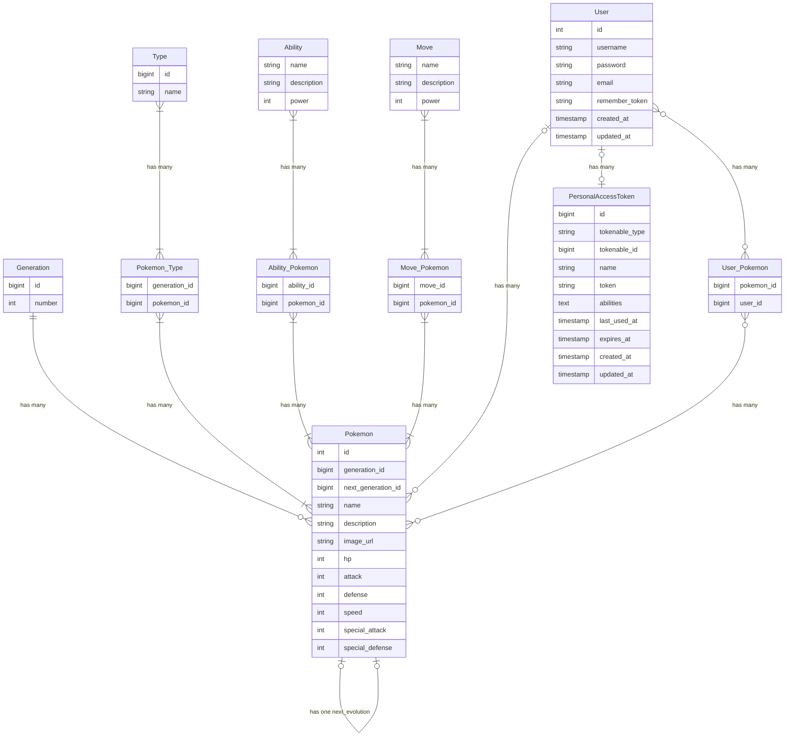

## Introduction

This document outlines the plans for building a proof of concept for a new Hero Management
System and social network, on behalf of the Hero Association, in the week of the 29th
January 2024.

The situation is as follows: Heroes play a crucial role in insuring the safety and
stability of society in the face of constant danger. Heroes are orchestrated by the Hero
Association. This association keep records and offer support to their member Heroes. This
involves a lot of manual, paper-based administration. This project's software solution
will digitize and streamline this administration, as well as give Heroes ownership of
their own public profile and ranking. Refer to the Associations
[formal briefing](https://bit-academy-deep-dive-docs.netlify.app/Case-Files/briefing)
for the exact requirements.

## Target Users

Hero Association administrative staff, who will be accountable for data integrity. And
Heroes themselves, who will manage their own profile, and gain insight into their rank and
public perception.

## Scope

### Must Have:

-   New Hero onboarding: Users should be able to follow an automatic, guided registration
    process where they provide all the necessary data for becoming a member of the
    Association.
-   Hero ELO Ranking: Heroes can participate in duels, thereby rising or falling in the
    global ranking system, making use of the [ELO Rating system](https://en.wikipedia.org/wiki/Elo_rating_system#Theory).
-   Administrative dashboard: Hero Association administrative staff must be able to accept
    data submissions by Heroes, and be able to correct existing data.

### Should Have:

-   Public Hero Profiles: Heroes should have a personal page where they can represent
    themselves to the public. Heroes should be able to vote on their favourite team members.
-   Heroic Achievements: Heroes should be able to build a portfolio of heroic feats, which
    have to be approved by Association staff.
-   Leaderboard: For a real-time, publicly available view into the ranking leaderboard, and
    other statistics.

### Might Have:

-   Tournaments: a curated set of duels for the highest ranking Heroes, rewarding extra
    points.

### Will Not Have:

-   Duelling software: The management system will include just a form for entering duel
    outcomes, we will not simulate duels, or write a referee program.

## User Stories

| As a (role): | In order to:                                                                               | I want:                                    | Deliverable:                               | Story points: |
| :----------- | :----------------------------------------------------------------------------------------- | :----------------------------------------- | :----------------------------------------- | :------------ |
| Hero         | Join the Association                                                                       | A streamlined on-boarding experience       | On-boarding form with front-end validation | 30            |
| Staff member | Validate Hero data submissions                                                             | An admin dashboard                         | FilamentPHP admin panel                    | 30            |
| Association  | Guarantee security and privacy                                                             | Authentication and authorization           | PHP Laravel Login system                   | 20            |
| Developer    | Have an overview of the project, requirements, wishes, constraints, technologies, planning | A project plan.                            | project_plan.md                            | 8             |
| Developer    | Have quick and easy stakeholder onboarding                                                 | A project readme                           | readme.md                                  | 6             |
| Developer    | Have quick and easy developer onboarding                                                   | Set up instructions in the project readme. | bullet point list in readme                | 6             |
| Hero         | To build a portfolio of heroic feats                                                       | Heroic activity log                        | Heroic timeline on profile page            | 12            |

## Planning

| Day: | Task:                           | Team members:       | Deliverable: |
| :--- | :------------------------------ | :------------------ | :----------- |
| 1    | Application Planning and Design | All                 |              |
| 1    | Set up Laravel project          | Wessel              |              |
| 1    | Project plan                    | Raymon              |              |
| 2    | Hero onboarding                 |                     |
| 2    | Admin Dashboard                 |                     |              |
| 2    | ELO Ratings                     |                     |              |
| 3    | Leaderboard                     |                     |              |
| 3    | Hero Profile pages              |                     |              |
| 4    | Presentation                    | All (except Raymon) |              |

## Technologies

The Hero Management system will be built using Laravel/PHP and MariaDB on the backend,
Laraval-Blade, vanilla JavaScript and TailWindCSS on the frontend. FilamentPHP will be
used to scaffold common web application components.

## Bounded contexts

The web platform will have components with distinct areas of focus that will
intercommunicate. These are the admin dashboard for administrative work, the onboarding
form for new Hero registration, a public leaderboard displaying the live ELO Ratinkgs and
noteworthy events.

### Database design

The following Entity Relation Diagram outlines the relations between the various database
entities that make up the backbone of this application.

